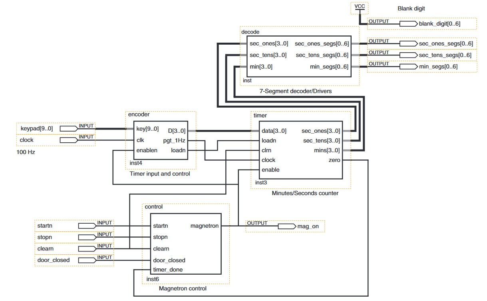

# IF675-Microwave
A microwave system implemented in Verilog
# Project structure
- Minutes/Seconds Timer
  - Counter Mod10
  - Counter Mod6
- Timer Input and Control
  - Encoder
  - Counter Freq/100
  - Counter 0-7
  - Mux
- Magnetron Control
  - And/Or/Not Logic
  - SR latch
- 7-Segment Decoder/Driver

